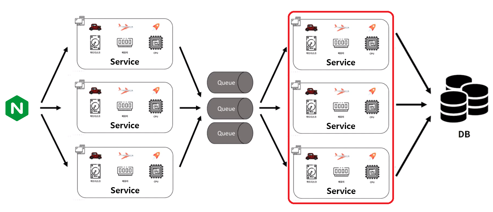

## 데브옵스 DevOps
* 데브옵스는 소프트웨어의 개발과 운영의 합성어
* 소프트웨어 개발자와 정보기술 전문가 간의 소통, 협업 및 통합을 강조하는 개발 환경이나 문화를 말한다.

<b>Docker란 ?</b>

* Docker는 컨테이너 기술을 사용하여 애플리케이션에 필요한 **환경을 신속하게 구축**하고 테스트 및 배포를 할 수 있게 해주는 플랫폼
* Docker는 도커파일에 운영체제, 실행 명령어를 저장해 두고 실행하면 항상 동일한 환경이 구성하여 인프라를 따로 설정하지 않아도 된다.
* 즉, 인프라를 코드화해서 관리할 수 있다. -> IaC(Infrastructure as Code)가 가능 하다
* Docker Image 란 컨테이너 생성(실행)에 필요한 모든 파일과 설정값(환경)을 지닌 것으로, 컴파일된 실행 파일을 묶은 형태이다.
* Docker Container 란 도커 이미지를 실행한 상태를 나타낸다.
* 따라서 도커를 이용하면 쉽고 빠른 실행 환경 구축이 가능하다.

<b>Jenkins란?</b>

* Jenkins 로고를 보면 웨이터가 있음. 웨이터는 쉐프가 만든 음식을 받아서 고객에게 전달해주는 역할을함
* 비슷한 의미로 Jenkins는 개발자의 요청을 받아서 빌드와 배포를 해주는 툴이다.
* 다른 주요 기능으로는 Batch가 있다. 요청을 모아서 주기적으로 처리해주는 역할을 한다.

<b>Jenkins를 이용한 Worker 인스턴스 접속</b>

* Jenkins를 이용하여 Worker인스턴스(서버임)에 안전하게 접속하기 위해서 SSH 접속을 이용했다.
* Jenkins에서 공개키, 개인키를 만들고 Worker인스턴스에 해당 공개키를 복사하여 주면 된다.
* 그러면 오직 Jenkins만 Worker에 SSH로 접속할 수 있게 된다.

<b>Forward Proxy와 Reverse Proxy 란?</b>

* Forward Proxy
    * 클라이언트가 요청을 보내면 직접 서버와 통신하는게 아니라 프록시 서버에 캐싱된 내용이나
    * 프록시 서버가 본서버에 요청을 하고 받은 응답을 클라이언트에게 전달해 주는 역할을 함
    * Forward 프록시는 클라이언트를 숨겨주는 역할도 함
* Reverse Proxy
    * Forward Proxy와 반대의 역할을 함
    * 리버스 프록시는 서버를 숨겨주는 역할도 함

<b>Nginx란 ?, Apache와 비교</b>

* 트래픽이 많은 웹사이트의 확장성을 위해 개발된 경량의 고성능 웹서버
* **리버스 프록시** 역할을 함 : 서버로 접근하는 클라이언트로부터 **보안강화**, **캐시가능**
* 로드 밸런싱(Load Balancing) : 서버로 접근하는 **부하를 분산**하기 위한 서비스
* Apache는 클라이언트 접속마다 Process 혹은 Thread 를 생성하는 구조를 가지고 있다.
    * 그 만큼 CPU와 메모리 사용이 증가하고 생성비용이 크기때문에 대용량 요청에 적합하지 않다.
    * 반면 Nginx는 하나의 프로세스 내에서 비동기 방식으로 작업을 처리하기 때문에 성능이 더 뛰어나다

<b>서버가 죽는 이유?</b>

* 일부 요청이 실패한다.
* 모든 요청이 실패한다.
    * 네트워크에 장애가 생김
    * 서버 자체에 문제가 생김
    * 지나치게 높은 트래픽으로 행이 걸렸을때
        1. 아파치 톰캣으로 사용자의 요청이 들어오면 톰캣 내부의 메시지 큐에 요청이 들어감
        2. 놀고 있는 쓰레드가 있으면 요청을 받아서 처리함
        3. 요청이 많아지면, 톰캣의 큐의 사이즈보다 더 많은 요청이 오게 되고 이때부터 요청이 실패되어 버려짐
        4. 또는 큐에 들어오고 나서 처리되는데 까지 30초의 시간이 지나면 요청은 타임아웃 처리됨 -> 요청 실패되어 버려짐

<b>메시지 큐(Message Queue)란, 장점</b>

### 메시지 큐(Message Queue)란 ?
* 메시지큐란 비동기 메시지를 사용하는 다른 Application 사이에서 데이터의 교환을 처리하는 큐이다.
* 메시지큐를 이용하면 다음과 같은 상황들에 대해 효과적이다.
    * 데이터유실 ex1 : 요청이 많은 경우 아파치 톰캣(Tomcat)의 큐의 사이즈를 넘어가거나 타임아웃 처리될 수 있음
        * Thread가 실행중(200개가 default)이라면 톰캣 큐에 요청이 쌓임, 큐사이즈를 넘어가면 에러가 발생함
        * 큐에 쌓인 요청이 30s초(default값임)동안 처리되지 않으면 타임아웃 에러가 발생함
    * 데이터유실 ex2 : 톰캣이 종료될 경우 요청이 다 날아가 버림
    * Application간의 의존성이 존재할 수 있음
    * Application을 Scale out할 경우 성능상 고려해야할 문제가 많음
    * 무중단 배포시 위와 같은 상황으로 인해 여러가지 문제들이 발생할 수 있음, 사용자들에게 불편을 줄 수 있음

 

### 메시지 큐의 장점
* 메시지 큐는 **비동기적** 으로 동작한다. -> 요청을 저장했다가 나중에 처리할 수 있는것
    * DB에서 요청을 처리하는 시간보다 메시지큐에 메시지를 넣는 시간이 더 짧기 때문에,
    * DB속도와 무관하게 요청 메시지를 누락없이 저장했다가 처리할 수 있음
* Application간의 의존성 제거
    * Application A에서 Application B의 API호출을 통해 데이터를 전달하는 상황에서
    * Application B가 종료되는 순간 A가 보낸 데이터는 유실됨
    * 즉, A는 B에 대한 의존성이 생기는것
    * 이때 메시지 큐를 이용하면 요청에 대한 내용을 보존할 수 있음
* 확장성
    * Application을 scale out해도 메시지 큐는 기존의 것을 동일하게 유지할 수 있음
* 신뢰성 보장1 : 여러개의 큐를 사용할 수 있음
    * 물리적인 장애 또는 네트워크 장애로 메시지큐에도 문제가 발생할 수 있음.
    * 하지만 여러개의 큐를 사용하고, 큐 사이의 데이터를 지속적으로 동기화 하면
    * 어느 한쪽 큐에서 장애가 발생하더라도 전체 큐 서비스에 영향이 없도록 구성할 수 있음
* 신뢰성 보장2 : 요청 메시지가 실패하면 다시 큐에 넣어 메시지를 재실행할 수 있음
    * 메시지를 꺼내어 로직을 실행하는 도중에 예외가 발생하는 경우
    * 메시지를 다시 큐에 넣어 요청을 처리할 수 있음
* 무중단 배포에도 효과적임
    * 아래의 그림에서 빨간색 부분의 서비스들은 사용자의 트래픽을 직접적으로 받지 않음
    * 빨간색 부분의 서비스들이 잠시동안 전부 내려가 있더라도 **사용자는 체감하기 어려움**
    * 따라서 무중단 배포가 더 쉬워짐

 

* Kafka와 RabbitMQ 비교
    * [참고링크](https://ellune.tistory.com/29)
    * kafka는 클러스터를 통해 병렬처리가 주요 차별점인 만큼 방대한 양의 데이터를 처리할 때 장점이 부각됨
    * RabbitMQ는 데이터 처리보단 Manage UI를 제공하는 만큼 관리적인 측면이나, 다양한 기능 구현을 위한 서비스를 구축할 때 장점이 부각됨

<b>무중단 배포 : Rolling</b>

* **배포** 란 새로 개발된 코드를 패키징하여 서버에서 새로운 버전의 애플리케이션을 실행하도록 하는 행위를 뜻함
* **무중단 배포** 란 서비스의 중단 없이 이루어지는 배포를 뜻함
* 롤링 무중단 배포는 사용 중인 인스턴스 내에서 새 버전을 **점진적으로 교체**하는 것으로 무중단 배포의 가장 기본적인 방식
* 롤링 배포 장점 
    * 인스턴스마다 차례로 배포를 진행하기에 상황에 따라 손쉽게 롤백이 가능하다.
    * 추가적인 인스턴스를 늘리지 않아도 된다.
    * 간편한 관리
* 롤링 배포 단점
    * 새 버전을 배포할때 인스턴스의 수가 감소하기 때문에 사용중인 인스턴스에 트래픽이 몰릴 수 있다.
    * 배포가 진행될때 구버전과 신버전이 공존하기에 호환성 문제가 발생할 수 있다.
        * 업데이트 된 버전의 서버2, 안된 서버2개가 있으면 사용자들은 균일한 서비스를 받지 못할 수도 있는것임

<b>Failover(장애조치) & Failback(장애복구) ?</b>

* Failover와 Failback은 **장애 극복 기능** 이다.
* 장애조치 **Failover**
    * 시스템, 서버, 네트워크가 이상이 생겼을 경우 예비시스템으로 전환되는 기능
    * 실패한 요청에 대해 정상적으로 처리될 수 있도록 자동으로 응답있는 **다른 서버로 요청을 포워딩** 해줘야 함
    * 예를들어, 평상시에 A 장비를 사용하다가, A 장비에 장애가 발생하면 준비했던 B 장비를 사용한다.
    * 운영되고 있는 시스템은 **액티브(active)** , 같은 세팅으로 구성된 대기하는 시스템은 **패시브(passive)** 라고 한다.
    * 액티브에 문제가 생기면, 패시브 시스템이 액티브 상대로 변경되면서 서비스를 이어서 운영하게 되는 구조
    * 시스템 설계에서 **높은 가용성(HA)과 신뢰성** 이 요구되는 경우 페일오버 기능을 탑재하는 것이 일반적이다.
* 장애복구 **Failback**
    * Failover에 따라 전환된 서버/시스템/네트워크를 장애 **발생전으로 되돌리는 처리**
    * 예를 들어 DBMS 장애로 대체 시스템이 동작하다가 장애가 복구되면 DBMS를 동작시키고 대체 시스템의 서비스는 대기 상태로 작동

<b>Rolling 배포시 어떤 방식으로 요청을 제어?</b>

* Nginx의 로드밸런싱 기능을 활용하여 Worker노드의 버전을 올릴 수 있음
* Rolling 배포가 이루어 질때 Jenkins에서는 어떤 방식으로 제어?
    * 인스턴스가 배포가 되는 동안 sleep 이라는 명령어를 스크립트에 작성하여 배포 딜레이를 주어 임시로 해결했었음
* 서버에 지속적인 트래픽 유입이 있을때 Rolling 배포를 무중단으로 하기 위해선 어떠한 방법이 필요 ?
    * 페일오버(fail over) 
        * 장애 극복 기능
        * 실패한 요청에 대해 정상적으로 처리될 수 있도록 자동으로 응답있는 **다른 서버로 요청을 포워딩** 해줘야 함
    * 폴링 (polling) - 이건 옳은 대답인지는 확실치 않음
        * 리얼타임 웹을 위한 기법
        * 일정한 주기를 가지고 서버와 응답을 주고 받는 형식
        * 왜 사용? -> HTTP가 비연결성(Connectionless) 프로토콜이기 때문에 실시간을 위한 persistent connection이 불가능하기 때문
        * 예를들어 실시간 중계 같은 경우, 브라우저에서 N초 단위로 서버에 요청을 보내 업데이트 하는 방식임(스트리밍 방식이 더 좋긴 함)
        * 단점 : 폴링 주기가 짧으면 매번 요청으로 인한 자원낭비가 심하기 때문에 서버의 성능에 부담이 간다는 단점이 있음
        * 롱 폴링(Long Polling) 으로 해결할 수도 있음
            * 서버 이벤트가 발생할 때까지 응답을 미루는 방법, 폴링과 다르게 불필요한 네트워크 비용이 덜 발생
            * 서버 이벤트가 발생하는 즉시 응답을 하기 때문에 실시간성이 높음
            * 단점 : 반대로 서버 이벤트가 빈번하게 발생하면 폴링보다 더 많은 요청을 수행한다는 단점이 있음

<b>Rabbit MQ 구현했던 내용</b>

* Rabbit MQ UI를 통해 큐를 생성(queue이름 코드내용과 같게 해야 함)
* Gradle에 Rabbit MQ 의존성을 추가하고 야믈파일에 Rabbit MQ에 대한 Port설정과 큐에 대한 정보를 입력
    * 5672 : 메시지 주고 받을때 사용하는 포트
    * 15672 : 모니터링 페이지(Rabbit MQ UI 페이지)를 위한 포트, 이건 야믈에 설정없이 열어두기만 하면 됨
* 기존에는 API요청에 대한 내용을 받아서 JPA로 바로 처리했었지만 Rabbit MQ를 통해 메시지를 처리할 수 있도록 수정했음
* Producer와 Consumer를 주입받아 서 메시지를 처리했는데
* 이때, 메시지를 Json에서 String으로 바꿔서 넣어줘야 하기 때문에 Jackson 라이브러리의 ObjectMapper를 주입받아 사용함.
* 그럼 Producer를 통해 메시지큐에 요청에 대한 내용이 push되고 Consumer를 통해 컨트롤러가 수행되어 그 내용이 DB에 반영됨

 

* 요청을 늦게 응답할수록, 해당 요청이 톰캣의 쓰레드를 차지하고 있어서 쓰레드가 금방 고갈되는 이슈가 있음
* 요청을 가능하면 빠르게 처리하고 응답을 주어야 함 -> 쓰레드가 다시 다른 요청을 처리할 수 있는 상태가 됨

<b>클라우드(Cloud) VS 온프레미스(On-premise)</b>

* 클라우드
    * 서버 구입비 없음, 사용한 만큼 과금
    * 물리적 인프라를 관리할 필요가 없음
    * 트래픽에 맞게 자동으로 Scale-out 가능
    * 추가 서버 필요시 쉽게 추가 가능

 

* 온프레미스
    * 초기 서버 구입비로 비용 많이 필요함
    * 인프라를 관리하는데 인력이 필요함 (물리적인 관리 포함)
    * Peak의 트래픽을 감당하기 위해 평소에 불필요한 서버를 준비해야 함
    * 추가 서버 필요시 서버를 새로 설치해야 하므로 확장성이 낮다고 볼 수 있음

<b>리눅스 OS (CentOS vs Ubuntu)</b>

* [참고링크](https://coding-factory.tistory.com/318)
* 리눅스란 ?
    * 리눅스(Linux)는 UNIX운영체제를 기반으로 만들어진 운영체제, 오픈소스
    * 리눅스(Linux)는 유닉스(UNIX)와 마찬가지로 다중 사용자, 다중 작업(멀티태스킹), 다중 스레드를 지원하는 네트워크 운영 체제(NOS)
    * 리눅스의 원형이 되는 UNIX는 통신 네트워크를 지향하여 설계됨
    * 따라서 리눅스 역시 서버로 작동하는데 최적화 - 다양한 네트워킹 기술을 제공

 

* 리눅스의 종류
    * 수많은 버전의 리눅스가 존재하지만, 크게 두가지 계열의 리눅스로 나뉜다.
    * **레드햇계열** 과 **데비안계열**
    * 대표적인 버전으로 레드햇의 **CentOS** 데비안의 **Ubuntu**

 

* CentOS와 Ubuntu 비교
    * 성능은 비슷함
    * Ubuntu
        * Ubuntu는 개인용 데스크탑 운영체제로 많이 사용함
        * 레퍼런스가 많아서 학습하기 쉽다. 진입장벽이 더 낮다.
        * 자주 업데이트 되지만, 업데이트된 패키지가 안정화되기까지 시간이 걸림
    * CentOS
        * 사용자 기반이 적어 초보자들이 학습하기 어렵다.
        * 업데이트가 느리지만 안정적이고 안전하다. -> 서버용으로 좋음

 

* CentOS 지원종료
    * CentOS 8은 지원종료됨
    * CentOS 7은 2024/06/30 까지 지원
    * CentOS는 향후 CentOS Stream으로 전환 ?

### Todo
* 스트레스 테스트 툴
    * Artillery(Node.js)
    * nGrinder(Java)
    * Locust(Python)