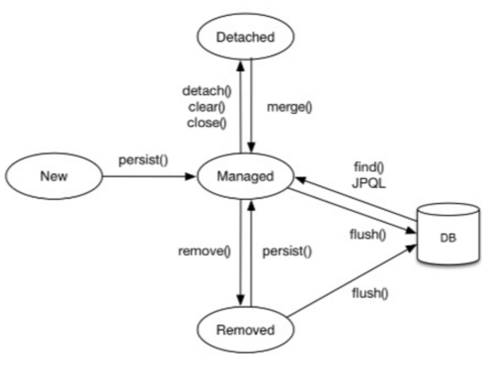
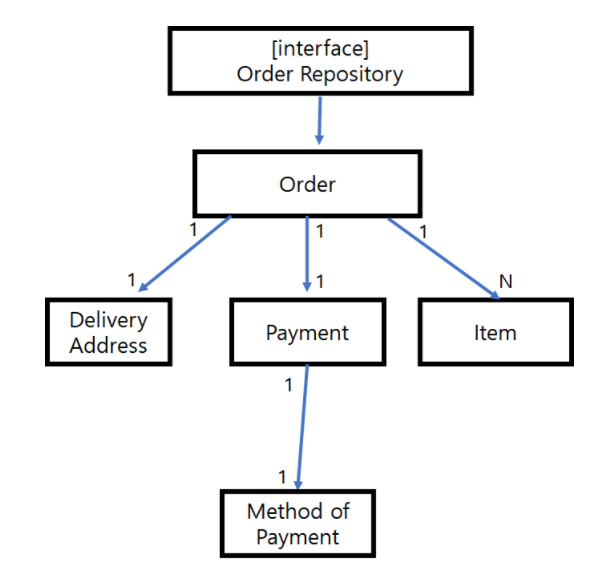

# JPA Note
JPA는 인터페이스임
구현체는 여러가지가 있음 hibernate는 그중 하나
[강의자료](https://ancient-citron-06b.notion.site/1a78337d9ad241cf86a3ff676e2cf3b5)

### 1. JPA를 사용해야 하는 이유
* 생산성 증진
    * SQL에 의존적인 개발에서 탈피하여, 객체중심으로 생산적인 개발이 가능하다.
* 객체와 관계형테이블의 패러다임 불일치
    * 객체지향 프로그래밍은 추상화, 캡슐화, 상속, 다형성 등을 제공한다.
    * 관계형 데이터베이스 데이터 중심으로 구조화 되어 있으며, OOP의 특징을 지원하지 않는다.

### 2. 엔티티(Entity)의 생성자
엔티티(`@Entity`)는 기본 생성자를 필요로 함 - proxy객체를 생성하려면 기본 생성자가 필요하기 때문
[참고링크](https://hyeonic.tistory.com/191)

따라서 기본적으로 생성자를 만들어주지 않고 default인 기본생성자를 사용하지만
파라미터가 있는 생성자를 필요로 한다면 기본생성자를 생성해 주어야 함
그런데 JPA에서는 생성자의 접근권한을 public, protected 까지만 허용하므로
보통 기본생성자를 사용하지 말라는 뜻으로 protected로 기본생성자를 사용함

아래와 같이 롬복을 이용하여 protected생성자를 간단하게 생성할 수도 있음
~~~java
@NoArgsConstructor(access = AccessLevel.PROTECTED)
~~~

  

*******************************************************************
### 3. JpaRepository<Entity, Id>

Repository 인터페이스에서 extends 키워드를 이용하여 JpaRepository<T, Id> 를 상속받으면
Entity Manager를 주입받는 코드를 따로 작성하지 않아도
제네릭으로 받은 타입에 대하여 save, find와 같은 기본적인 메소드를 제공받을 수 있음

아래와 같이 선언할 수 있는데 T에는 엔티티 타입, Id에는 Id의 타입을 적어줌
~~~java
public interface OrderRepository extends JpaRepository<Order, String> {
    List<Order> findAllByOrderStatus(OrderStatus orderStatus);
    List<Order> findAllByOrderStatusOrderByOrderDatetime(OrderStatus orderStatus);
}
~~~

  

*******************************************************************
### 4. Entity Manager Factory와 Entity Manager
Entity Manager Factory
* Entity를 관리하는 EntityManager를 생산하는 공장이다.
* Thread Safe하다

Entity Manager
* Entity를 저장하고 수정하고 삭제하고 조회하는 (CRUD)등 Entity와 관련된 모든 일들을 처리
* **Thread Safe하지 않다.** 여러 Thread에서 동시에 접근할 경우 동시성 이슈가 발생할 수 있다.
* 따라서 Factory를 통해서 단위 스레드마다 새로운 Entity Manager에 접근할 수 있도록 하는 전략을 사용해야 함

  

*******************************************************************
### 5. 영속성 컨텍스트의 특징
- 영속성 컨텍스트와 식별자 값
    - 영속성 컨텍스트 안에서 관리되는 엔티티는 식별자 값을 반드시 가져야한다.
    - key-value로 엔티티를 관리하기 때문이다.
- 영속성 컨텍스트와 데이터 베이스 저장
    - **JPA는 트랜잭션을 커밋하는 순간** 영속성 컨텍스트에 새로 저장된 **엔티티를 DB에 반영**한다.  (**FLUSH**)
    - **플러시(flush)는 영속성 컨텍스트의 변경 내용을 DB에 동기화하는 작업**인데, 이때 등록, 수정, 삭제한 엔티티를 DB에 반영한다.
- 영속성 컨텍스트가 엔티티를 관리함으로 얻는 이점
    - 1차 캐시
    - 동일성 보장
    - 트랙잭션을 지원하는 쓰기 지연
    - 변경 감지
    - 지연 로딩

  

*******************************************************************
### 6. 엔티티 생명주기

- 비영속 (new / transient) : 영속성 컨텍스트와 전혀 관계가 없는 상태
- 영속 (managed) : 영속성 컨텍스트에 저장된 상태
- 준영속 (detached) : 영속성 컨텍스트에 저장되었다가 분리된 상태
- 삭제 (removed) : 삭제된 상태

  

*******************************************************************
### 7. 스냅샷, update ?
commit()또는 flush()가 일어날 때 엔티티와 **스냅샷**을 비교해서, 변경사항이있으면 UPDATE 쿼리를 날려줌

* 스냅샷
특정 시간에 데이터 저장 장치의 상태를별도의 파일이나 이미지로 저장하는 기술
스냅샷 기능을 이용하여 데이터를 저장하면 유실된 데이터 복원과 일정 시점의 상태로 데이터를 복원할 수 있다.

  

*******************************************************************
### 8. dirty checking(=변경감지), `@DynamicUpdate`
dirty checking은 변경감지를 뜻함
영속성 컨텍스트가 관리하는 엔티티에만 dirty checking이 적용됨
준영속상태 엔티티는 dirty checking이 안됨
flush()가 수행될시 dirty checking이 된 엔티티는 UPDATE 쿼리가 나감
하지만 Dirty Checking으로 생성되는 update 쿼리는 기본적으로 모든 필드를 업데이트함
JPA에서는 전체 필드를 업데이트하는 방식을 기본값으로 사용하기 때문

* 전체 필드 업데이트의 장점
    * 생성되는 쿼리가 같아 부트 실행시점에 미리 만들어서 재사용가능
    * 데이터베이스 입장에서 쿼리 재사용이 가능 -> 동일한 쿼리를 받으면 이전에 파싱된 쿼리를 재사용

하지만 엔티티가 필드를 대략 15개이상씩 가진다면 Update쿼리에 많은 리소스가 사용되므로 성능에 문제가 생길 수 있음
이러한 경우는 거의 없지만 이 경우 엔티티에 해당하는 클래스에 `@DynamicUpdate`어노테이션을 사용해주어 해결가능

  

*******************************************************************
### 9. 웹앱의 2가지 렌더링 방식 (Thymeleaf vs React)
**부제 : React를 꼭 배워야 할까?**

* from 김영한
웹 애플리케이션 개발은 크게 2가지 렌더링 방식이 있습니다.

1. 서버 사이드 렌더링
설명: 서버에서 완전한 HTML을 만들어서 내려줍니다. 대표적으로 jsp, thymeleaf, velocity, freemarker가 있습니다.
장점: 단순하고, 학습 곡선이 낮습니다. 백엔드 개발자도 쉽게 개발할 수 있습니다.
단점: 동적이면서 복잡한 화면을 만들기 어렵습니다.

 

2. 클라이언트 사이드 렌더링
**설명**: 서버는 API만 제공하고, 자바스크립트 프레임워크가 템플릿과 서버 API 응답 결과를 조합해서 HTML 화면을 동적으로 만듭니다. 
대표적으로 react, vue.js, angularJS 등이 있습니다.
**장점**: 동적이고, 복잡한 화면을 만들기 좋습니다.
**단점**: 공부할 분량이 매우 많습니다. 자바스크립트에 능숙해야 합니다. 웹 프론트엔드 개발자라는 전문 분야가 있습니다.

 

3. 정리
클라이언트 사이드 렌더링은 웹 프론트엔드 개발자라는 전문 분야가 있을 정도로 학습해야 할 내용이 많습니다. 저희 회사를 비롯한 대부분의 회사가 백엔드 서버 개발자와 웹 프론트엔드 개발자를 별도로 채용합니다.
실무에서는 서버 사이드 렌더링도 필요하고 클라이언트 사이드 렌더링도 필요합니다. 단순하고 정적인 화면이라면 서버 사이드 렌더링 기술로 개발을 금방 끝낼 수 있습니다.
제가 추천하는 방법은 먼저 서버 사이드 렌더링 기술을 하나라도 배우고, 그 다음에 여유가 되면 클라이언트 사이드 렌더링 기술은 옵션으로 배우시는 것을 추천드립니다.

 

4. 그래서 어떻게 공부하는것이 좋을까?
(1). 자바스크립트에 자신있고, 완전 풀스택으로 갈것이다. = react + typescript
(2). 백엔드 개발이 좋고, 스프링이 좋은데, 어쩔 수 없을 때 화면을 찍겠다. = thymeleaf
(3). 레거시 하는 회사에 입사해야 한다. = jsp (ㅠㅠ)
(4). velocity는 그냥 그걸 사용하는 회사에 입사하고 고민해도 됩니다. ㅎㅎ (쉬워서요 ㅎㅎ)
감사합니다.

  

*******************************************************************
### 10. 연관관계의 주인 
- 객체를 양방향 연관관계로 만들면, 연관관계의 주인을 정해야 한다.
- 외래키를 관리할 객체를 지정한다. (INSERT, UPDATE, DELETE)
- **연관관계 주인만이, 외래키를 등록 수정 삭제 할 수 있다. (주인이 아닌쪽은 읽기만 가능하다(MappedBy).)**
- 즉, mappedBy 속성을 사용하지 **않는** 쪽이 주인.
- 테이블중 FK 가 있는 쪽이 연관관계 주인이 된다. (회원(1) - 주문(N) → 주문 엔티티가 연관관계의 주인이된다.)

* 아래와 같은 코드에서는 Host가 연관관계의 주인이 **아니라** Product클래스의 host 멤버가 연관관계 주인 이라는 뜻
~~~java
//...
@Entity
public class Host{
    //...
    @OneToMany(mappedBy = "host")
    private List<Product> products;
    //...
}

~~~

  

*******************************************************************
### 11. 객체 그래프 탐색
객체 A가 있을 때 A가 참조하는 다른 객체 B, C, D 등을 A를 통해 참조하는 것을 객체 그래프 탐색이라고 한다. 
(참조를 사용해서 연관관계를 탐색하는 것을 객체 그래프 탐색이라 한다.)
-> JPA를 이용하면 객체 그래프를 마음껏 탐색할 수 있다. (지연로딩, 즉시로딩 관련)

* 예시 코드
~~~java
class Member {
	private long id;
	private List<Order> orders;
}

class Order {
	private String id;
	private Member member;
}

... 
@Test
void graph() {
	Member member1 = new Mebmer(1);
	Order order1 = new Order(1)

	member1.setOrders(Lists.newArrayList(order1));

	Order findOrder= member1.getOrders().get(o); // 객체 그래프 탐색이라 한다.
	findOrder.getMember();
}
~~~

  

*******************************************************************
### 12. `@Lob`
* Large OBject의 줄임말
* 필드에 문자열의 길이를 지정하지 않는다면 Default로 varchar(255)까지 가능한데,
더 긴 문자열이나 Image같은 데이터를 저장해야 한다면 더 긴 문자열이 필요하기 때문에
이때 해당 필드에 `@Lob`을 붙여줌

  

*******************************************************************
### 13. EntityManager clear()
한 트랜젝션내에서 em.clear();를 해주지 않으면
이전에 생성,조회 되거나 변경감지된 엔티티들은 계속해서 영속성 컨텍스트에서 관리됨

  

*******************************************************************
### 14. 양방향 연관관계 매핑 (with 연관관계 주인, 연관관계 편의 메소드)
`@JoinColumn` , mappedBy 어떻게 사용하는걸까?
코드먼저 살펴보자

* 일대다(`@OneToMany`) 매핑 예시 코드
~~~java
public class Member{
    @Id @GeneratedValue
    private Long id;
    //.....
    
    @OneToMany(mappedBy = "member")
    private List<Order> orders = new ArrayList<>();
    //.....

    public void addOrder(Order order) {
        order.setMember(this);
    }
}

public class Order {
    //.....
    @Column(name = "member_id", insertable = false, updatable = false) // fk
    private Long memberId;

    @ManyToOne(fetch = FetchType.LAZY)
    @JoinColumn(name = "member_id", referencedColumnName = "id")
    private Member member;
    //.....

    public void setMember(Member member) { // 연관관계 편의 메소드
        if (Objects.nonNull(this.member)) {
            member.getOrders().remove(this);
        }
        this.member = member;
        member.getOrders().add(this);
    }
}
~~~

### 코드설명
* 양방향 연관관계에서는 **외래키**를 가진 엔티티가 **연관관계의 주인**임
* 코드로는 mappedBy속성을 사용하지 않는 엔티티가 연관관계의 주인(위에서는 Order가 주인)
* mappedBy : 양방향일 때 사용하는 반대쪽 매핑의 **필드 이름**을 값으로 준다.
즉, Member클래스의 `mappedBy = "member"`코드에서의 member는
Order클래스의 `private Member member;`에서의 member임
* `@JoinColumn(name = "member_id", referencedColumnName = "id")` : 조인컬럼은 외래키를 매핑할 때 사용한다.

| 속성                | 기능                                   | 기본값(default)                              |
| ------------------- | -------------------------------------- | -------------------------------------------- |
| name                | 매핑할 외래키 이름                     | 필드명 + _ + 참조하는 테이블의 기본키 컬럼명 |
| referecedColumnName | 외래키가 참조하는 대상 테이블의 컬럼명 | 참조하는 테이블의 기본키 컬럼명              |

  

*******************************************************************
### 15. 상속관계 매핑
관계형DB는 상속관계 매핑이 없지만 아래와 같은 전략으로 논리적으로 구체화 할 수 있다.

1. JOINED : 조인 전략
2. SINGLE_TABLE : 단일 테이블 전략
3. TABLE_PER_CLASS : 구현 클래스마다 테이블 전략

* 상속관계 표시
`@Inheritance(strategy = InheritanceType.전략이름)`
전략이름에 JOINED, SINGLE_TABLE, TABLE_PER_CLASS 3개중 하나가 들어감
위 어노테이션을 부모클래스에 붙여주면 됨

* JPA에서 default는 SIGNLE_TABLE 전략임

* `@DiscriminatorValue(name = "DTYPE이름")`
DTYPE이라는 속성을 테이블에 추가하여 어떤 타입인지 명시해 줄 수 있음
default는 테이블명임

* 상속관계 매핑 코드 예시 (전략에 대한 설명은 코드 뒤에)
~~~java
@Inheritance(strategy = InheritanceType.SINGLE_TABLE)
@DiscriminatorColumn(name = "DTYPE")
@Table(name = "item")
public abstract class Item {
    //....
}

@Entity
@DiscriminatorValue("FOOD")
public class Food extends Item{
    //....
}

@Entity
@DiscriminatorValue("CAR")
public class Car extends Item{
    //....
}
~~~

 

* JOINED : 조인 전략
위 코드의 경우 ITEM, FOOD, CAR 테이블이 생성되며
ITEM과 자식클래스에 해당하는 테이블과 JOIN하여 조회됨
ITEM의 PK가 자식 클래스의 테이블에서 PK,FK로 쓰임
JPA스펙상 `@DiscriminatorColumn`를 생략해도 DTYPE을 추가해 주지만 hibernate에서는 생략해 줌
운영상 조인 전략을 사용해도 DTYPE을 추가해 주는것이 좋음
장점 : 데이터가 정규화되어 있음, 외래키 참조하여 제약조건 활용가능(ex-> 가격정산시 ITEM테이블만 보면 됨), 저장공간 효율적
단점 : Join쿼리가 많아지므로 성능이 단일 테이블 전략보다 떨어짐, 저장시 INSERT쿼리 2번나감, **복잡함**

 

* SINGLE_TABLE : 단일 테이블 전략
ITEM테이블 하나만 생성되며, 테이블에서 하위클래스에 해당하는 엔티티의 멤버를 모두 속성으로 가지고 있지만
데이터 종류에 따라서 사용되는 속성을 제외하고는 모두 NULL로 저장됨 -> DTYPE을 통하여 구분할 수 있음
단일 테이블 전략에서는 `@DiscriminatorColumn`를 생략해도 JPA가 자동으로 DTYPE을 추가해 줌
장점 : 쿼리가 단순하므로(하나만 나감) 성능이 좋아 현업에서 많이 채택되는 전략
단점 : 자식 엔티티가 매핑한 컬럼은 모두 **null을 허용**해야 함, 테이블이 커질 수 있음

 

* TABLE_PER_CLASS : 구현 클래스마다 테이블 전략
ITEM테이블 없이 FOOD, CAR 테이블만 생성되며 각 테이블에는 ITEM의 멤버들이 속성으로 추가된다.
따라서 `@DiscriminatorColumn`이 의미가 없는 전략이며 명시해 줘도 DTYPE이 추가되지 않음
**단점** : 조회할때 UNION ALL 쿼리로 모든 하위클래스들을 조회해야 하므로 조회시 성능이 많이 떨어짐
자식 테이블을 통합해서 쿼리하기 어려움, 코드 변경시 하나하나 다 뜯어 고쳐야 함
**쓰지 말아야 할 전략**

  

*******************************************************************
### 16. `@MappedSuperclass`

* **상속관계 매핑**과는 다른 개념임
* 해당 어노테이션이 붙은 클래스를 다른 엔티티에서 상속시, 상속받은 클래스의 필드들이 DB에서 엔티티의 컬럼으로 생성됨
* `@MappedSuperclass`를 안붙이고 상속하면 그냥 java코드에서만 상속받은 클래스의 필드를 사용할 뿐임. (DB에 업뎃안됨)
* 공통 **매핑 정보**가 필요할 때 사용(id, createdDate 처럼 모든 테이블에 들어가는 정보같은 것들)
* 어노테이션 붙여주면 테이블이 생성되지 않으며 조회도 안됨
* 클래스가 단독으로 쓰이지도 않고 직접 사용되지 않으므로 abstract로 생성하는것이 좋음

* 코드 예시
~~~java
@MappedSuperclass
public abstract class BaseEntity {
    
    private String createdBy;
    private LocalDateTime createdDate;
    // @Column(name = "updatedBy") // 컬럼 이름도 지정 가능 !
    private String lastModifiedBy;
    // @Column(name = "updatedDate")
    private LocalDateTime lastModifiedDate;

    // getter, setter
    // ......
}
~~~

  

*******************************************************************
### 17. abstract 클래스
abstract클래스와 아닌 클래스의 가장 큰 차이는
abstract클래스는 **단독**으로 쓰이는 경우가 없고 일반 클래스는 있다는 것이다.
따라서 `@MappedSuperclass`가 붙은 클래스처럼 직접 사용되지 않으면 abstract 클래스로 선언해 주는것이 좋다.

  

*******************************************************************
### 18. JPA에서의 extends 키워드
* JPA에서 extends는 `@Entity`가 붙은 클래스이거나 `@MappedSuperclass`가 붙은 클래스만 상속가능
* `@Entity`클래스를 extends한 경우는 상속관계 매핑
* `@MappedSuperclass`클래스를 extends한 경우는 매핑 정보를 상속한 것임

  

*******************************************************************
### 19. 식별자(id)를 둘 이상 사용하려면?
1. `@IdClass` 전략
2. `@EmbeddedId` 전략 -> 현업에서 많이 씀
* --업뎃중--

  

*******************************************************************
### 20. 영속성 전이 Cascade
* Cascade 종류
    * ALL: 모두 적용
    * PERSIST : 영속
    * REMOVE  : 삭제
* 보통 Cascade를 사용할때 **저장할때만** Cascade하고 싶으면 **PERSIST**,
* 그렇지 않으면 **ALL** 사용함
* 현업에서는 Cascade사용시 ALL or PERSIST 둘중 하나로 많이 사용
* Parent와 Child클래스의 Life Cycle이 유사할때, Child에 대해서 Parent가 단일 소유자 일때 Cascade 사용

> 단순하게 설명하면, persist() 호출을 줄여주는 역할을 함
> 동일한 라이프 사이클일때만 사용하는 것이 좋음
> 만약 다른곳에서도 사용하는 엔티티라면 별도의 Repository를 생성해서 persist를 따로 하는것이 좋음
> 즉, 어떤 엔티티에 종속적인 엔티티일때 사용하면 좋음 -> 라이프 사이클이 같기 때문

> ex) 활용프로젝트에서 `OrderService`의 order 메소드를 보면,
> `Order`엔티티(주문)을 생성할때 생성자 매개변수로 `Delivery`와 `OrderItem`엔티티의 객체는 새로 생성되는 객체이고, 
> `Order`엔티티에서 두 객체에 대해 cascade를 설정해 놨기 때문에,
> `OrderService`의 order메소드에서 `OrderRepository`를 통해 주문(`Order`)을 persist하는 과정에서
> `Delivery`와 `OrderItem`엔티티 객체는 영속성 전이를 통해 `Order`와 함께 persist됨
> 이때, `Delivery`와 `OrderItem`엔티티는 `Order`에서만 양방향 연관관계로 사용되므로 동일한 라이프 사이클을 가짐.
> 따라서 영속성전이(cascade)를 사용할 수 있는것

> 두번째 줄에서 설명했듯이, 만약 다른 라이프 사이클을 가진다면 cascade를 사용하지 않고 따로 persist하는것이 더 좋은 선택
> 프로젝트 규모가 큰 경우, cascade를 사용하기 애매하거나 사용해도 되는지 헷갈린다면 사용하지 않는것이 좋다.
> DDD의 Aggregate Root와 잘 어울린다

* 간단 정리
1. 완전 개인 소유인 경우에 사용할 수 있다.
2. DDD의 Aggregate Root와 어울린다.
3. 애매하면 사용하지 않는다.

  

*******************************************************************
### 21.고아객체
* 부모 엔티티와 연관관계가 끊어진 자식 엔티티
`orphanRemoval = true` 로 고아객체를 자동으로 삭제 가능
-> `@OneToMany(mappedBy="...", casecade = CasecadeType.ALL, orphanRemoval = true)` 와 같이 사용

* 고아객체 예시
~~~java
Parent parent1 = em.find(Parent.class, id);
parent1.getChildList().remove(0);
// 자식엔티티를 컬렉션에서 제거?
// -> 연관관계가 끊어짐 -> 제거된 자식엔티티: 고아객체
~~~
부모엔티티, 자식엔티티
* **참조하는 곳이 하나일때만 사용!!**
* **특정 엔티티가 개인 소유할 때 사용!!**
* **즉, `@OneToOne`, `OneToMany`만 일때만 사용!!**
* 이것은 CasecadeType.REMOVE 처럼 동작함

* `cascade = CasecadeType.REMOVE`와 `orphanRemoval = true`의 차이점은 ?
Member에 List<Order> orders가 있을때 member.setOrders(null); 적용시,
`cascade = CasecadeType.REMOVE`만 적용시 연관된 order엔티티들은 삭제되지 않음
`orphanRemoval = true`는? DB에서 연관된 order는 모두 삭제됨
즉, `orphanRemoval = true`는 연관된 엔티티에 대하여 참조하지 않는 엔티티(=고아객체)라면 모두 삭제
`cascade = CasecadeType.REMOVE`는 코드로 **삭제**되기 전까지는 삭제되지 않는 것임

  

*******************************************************************
### 22. DDD와 Aggregate Root
* [출처](https://eocoding.tistory.com/36)

* DDD에서 엔티티(Entity)마다 리파지토리(Repository)를 만드는 경우가 많은데 
이럴 때 여러 엔티티를 묶어서 하나처럼 사용하는 경우가 많다. 
이러한 연관 객체의 묶음을 Aggregate라고 하고 그 안에 포함되어 있는 특정 Entity를 Aggregate Root라고 한다. 
여러 엔티티를 묶어서 가져오는 경우가 많을 땐 
개발에서 Aggregate Root에 해당되는 Entity에 대해서만 Repository를 만드는 경우가 많다.

 

* 예시
아래와 같이 각 엔티티별로 연관관계를 가지도록 설계했다고 하자.
Order(주문) 엔티티는 Delivery Address (배송지) 필드를 가지고, 
Payment(지불정보) 엔티티, Item(상품정보) 엔티티와 연관관계를 가진다. 
Payment(지불정보)엔티티는 지불 방식에 대한 정보를 가진 Method of Payment 엔티티와 연관관계를 가진다고 하자. 

* 즉, Aggregate는 우리가 데이터 변경의 단위로 다루는 연관 객체의 묶음이고, 
여기엔 루트(Root)와 경계(Boundary)가 있다. 루트는 하나만 존재하고, Aggregate 내의 특정 엔티티를 가리킨다. 
경계 안의 객체는 서로 참조할 수 있지만, 경계 바깥의 객체는 해당 Aggregate의 구성요소 중 루트에만 참조할 수 있다.

  

*******************************************************************
### 23. 둘 이상의 식별자(ID)를 가진 엔티티
JPA는 영속성 컨텍스트에 엔티티를 보관할때, eqauls & hashCode를 이용해서 동등성 비교를 한다.
그래서 그냥 `@Id`를 2개 붙이면 컴파일 오류가 나기 때문에 **별도의 식별자 클래스**를 생성해 주어야 한다.
* 식별자 클래스를 생성하기 위해서는 아래의 조건을 만족해야 한다.
    1. Serializable 인터페이스를 상속받아야 한다.
    2. eqauls, hashCode를 구현해야 한다.
    3. 기본 생성자가 있어야 한다.
    4. 식별자 클래스는 public 이어야 한다.

2번은 롬복의 `@EqualsAndHashCode`,
3번은 롬복의 `@NoArgsConstructor`을 이용하여 간편하게 설정가능하다.

식별자 클래스를 사용하는 방법으로, 아래의 2가지 어노테이션을 이용하는 방법이 있다.
1. `@IdClass(클래스이름.class)`
2. `@EmbeddedId`

2번의 `@EmbeddedId`를 이용하는 방법이 조금 더 **객체지향적인** 방법이기 때문에 현업에서 많이 사용하는 방법이다.

 

#### 1. `@IdClass(클래스이름.class)` 사용

* 코드 예시 : IdInfo가 별도의 식별자 클래스, TwoIdClass가 2개의 id를 가진 클래스
~~~java
@EqualsAndHashCode // 롬복
@NoArgsConstructor // 롬복 : 기본 생성자 생성
@AllArgsConstructor
public class IdInfo implements Serializable {
    private String id1;
    private String id2;
}

//************************************************//
@Entity
@IdClass(IdInfo.class)
public class TwoIdEntity {
    @Id
    private String id1;
    @Id
    private String id2;
}

//************************************************//
TwoIdEntity tie = new TwoIdEntity();
tie.setId1("id1");
tie.setId2("id2");

~~~

 

#### 2. `@EmbeddedId` 사용
식별자 클래스에는 `@Embeddable`를 추가로 붙여 주어야 한다.

* 코드 예시
~~~java
@Getter
@EqualsAndHashCode
@NoArgsConstructor
@AllArgsConstructor
@Embeddable
public class IdInfo implements Serializable {
    private String id1;
    private String id2;

}

//************************************************//
@Entity
public class TwoIdEntity {
    @EmbeddedId
    private IdInfo id;
}

//************************************************//
TwoIdEntity tie = new TwoIdEntity();
tie.setId(new IdInfo("id1", "id2"));
log.info("{} {}", tie.getId().getId1(), tie.getId().getId2());

~~~

  

*******************************************************************
### 24. EntityManager 준영속
영속성 컨텍스트가 관리하던 영속상태의 엔티티를 영속성 엔티티가 관리하지 않게 되었을때
그 엔티티를 준영속 상태에 있다고 표현한다.
update하거나 delete하여 새로운 엔티티가 대신하는것이 아닌, 
특정 엔티티를 준영속 상태를 만들기 위해서는 아래의 EntityManager의 메소드를 이용하면 된다.

1. **detach()** : 영속성 컨텍스트로 부터 분리
2. **close()** : 영속성 컨텍스트 닫음
3. **clear()** : 영속성 컨텍스트 초기화

  

*******************************************************************
### 25. @Transaction(readOnly=true)
모든 데이터의 변경은 transaction안에서 이루어 져야 함
하지만 **엔티티**에 `@Transaction(readOnly=true)`를 붙여서 읽기 전용으로 만들 수도 있음

트랜잭션에 `readOnly = true` 옵션을 주면 강제로 flush를 하지 않는 이상 플러시가 일어나지 않는다.
flush가 일어나지 않는다는것은 변경감지가 일어나지 않고 DB에 데이터를 보내지 않는것을 의미한다.
따라서 트랜잭션 커밋을 해도 **엔티티의 등록, 수정, 삭제**가 동작하지 않는다.
또한 읽기 전용이므로 영속성 컨텍스트는 **변경 감지**를 위한 **스냅샷**을 보관하지 않으므로 
성능이 향상되며 메모리 사용량을 최적화할 수 있다.

* 두줄요약
엔티티를 읽기 전용으로 설정하면 변경감지를 위한 스냅샷을 유지하지 않아도 되어
영속성 컨텍스트에서 flush를 할 필요가 없으므로 성능을 최적화 할 수 있다.

  

*******************************************************************
### 26. @GeneratedValue
식별자(Id)에 붙는 `@GeneratedValue`는 JPA가 알아서 Id값을 생성해 줌
단, persist할때 Id가 생성되어 DB에 저장됨. 그 전까지는 Id가 생기지 않음
`@GeneratedValue`에 옵션을 주지 않으면 Auto전략으로 작동되는데
DB마다 다른 전략을 가짐

  

*******************************************************************
### 27. CrudRepository를 통한 save와 Update
CrudRepository의 save를 통해 create 엔티티와 update 엔티티가 가능함
repo.save(엔티티); 에서 엔티티의 ID가 생성이 안된 경우에는 (primitive type인 경우는 0, 객체(Id가 2개일 경우)인 경우는 null을 뜻함)
persist를 하지만 이미 Id를 가진 엔티티를 save하면 merge()가 실행 되므로 조심해야 함
따라서 id에 @GeneratedValue를 사용하거나 Persistable<String>인터페이스를 상속받는 방법이 있는데
Persistable<String>를 상속받는 방법은 김영한 **<실전! Spring Data Jpa>** 강의 중
**스프링 데이터 JPA 분석** 편을 참고

update는 변경감지를 사용하는데 아래의 코드는 save에서 merge()가 수행될것 같지만
영속 상태의 엔티티를 merge하게 되면 무시되므로 merge가 안되고 알아서 변경감지하여 update해줌

* 코드 예시
~~~java

@Autowired 
CustomerRepository repository; // CustomerRepository는 CrudRepository<Customer, Long> 상속

Customer customer = new Customer(); // Customer는 필드로 @GeneratedValue Long id , String firstName, String lastName 이 있음
customer.setFirstName("Chanui");
customer.setLastName("Jeon");

//........

Customer foundCustomer = repository.findById(customer.getId()).get();
// 변경 감지를 통한 update
foundCustomer.setFirstName("Barbera"); // Mapping : 컨트롤러에서는 DTO를 통해 매핑
// 영속 상태의 엔티티를 merge하게 되면 무시함 -> merge cascade 설정되어 있으면 merge cascade가 발생 가능
Customer updatedCustomer = repository.save(foundCustomer);
~~~

  

*******************************************************************
### 28. Method Query 메소드 쿼리
* [spring docs 레퍼런스 : 메소드 쿼리](https://docs.spring.io/spring-data/jpa/docs/current/reference/html/#jpa.query-methods)
* Spring Data Jpa를 이용하여 메소드로 쿼리를 만드는 방법
* `@Query` 어노테이션과 JPQL을 이용하여 **커스텀 쿼리**를 생성할 수도 있다.
* querydsl을 이용하여 쿼리를 생성할 수도 있는데 이건 나중에...

* 예시 코드 : 위의 레퍼런스를 참고하면 아래와 같은 메소드 쿼리를 생성할 수 있다.
~~~java
public interface OrderRepository extends JpaRepository<Order, String> {

    // SELECT * FROM orders WHERE order_status = 'OPEND'
    List<Order> findAllByOrderStatus(OrderStatus orderStatus); // 메소드 쿼리

    // SELECT * FROM orders WHERE order_status = 'OPEND' ORDER BY order_datetiem
    List<Order> findAllByOrderStatusOrderByOrderDatetime(OrderStatus orderStatus); // 메소드 쿼리

    // 어노테이션과 JPQL을 이용한 메소드 쿼리
    @Query("SELECT o FROM Order AS o WHERE o.memo LIKE %?1%")
    Optional<Order> findByMemo(String memo);

}
~~~

  

*******************************************************************
### 29. DTO와 transaction
한 트랜잭션 내에서 관리중인 엔티티를 그 트랜잭션 밖으로 가져가는것은 OSIV패턴에 위배됨 (예상치 못한 쿼리가 나갈 수 있음)
트랜잭션 내의 layer 밖에서는 DTO를 만들어서 통신하는것이 좋은 방법임.

  

*******************************************************************
### 30. DTO는 어떻게 구성?
DTO와 Entity를 1:1로 매핑하여도 됨
-> DTO랑 엔티티의 필드정보를 동일하게 만들어 줘도 된다는 뜻

  

*******************************************************************
### 31. @Transient
영속대상에서 제외시키기 위해 붙여주는 어노테이션
필드에 붙여주면 해당 필드가 DB컬럼에 들어가지 않음
메소드에 붙여주면 해당 메소드는 영속화에 영향을 주지 않게 됨

  

*******************************************************************
### 32. @ManyToOne(optional = true)
`@ManyToOne`은 `@OneToMany`와는 다르게 optional 이라는 옵션이 있다.
optional = false 이면 해당 필드에 null이 들어갈 수 있음을 의미하며
optional = true 라면 값이 반드시 들어가야 함을 의미한다.
default는 true이다.

  

*******************************************************************
### 33. Spring Data JPA : query method
* query method
    find~~ : optional 반환
    get~~ : 객체 반환

  

*******************************************************************
### 34. Auditing
데이터를 생성시, 변경시에 아래의 필드들을 초기화해 줄 수 있음

* 코드예시
~~~java
@Getter
@MappedSuperclass
@EntityListeners(AuditingEntityListener.class)
public abstract class BaseEntity {

    // Note : 엔티티가 생성되어 저장될 때 시간이 자동 저장됨
    @CreatedDate
    @Column(updatable = false)
    private LocalDateTime createdAt;

    // Note : 조회한 Entity 값을 변경할 때 시간이 자동 저장됨
    @LastModifiedDate
    private LocalDateTime updatedAt;
    
    @CreatedBy
    @Column(updatable = false)
    private String createdBy;

    @LastModifiedBy
    private String updatedBy;

}
~~~

* 최상위 경로의 Application 클래스
~~~java
@EnableJpaAuditing // 추가해 주어야 함
@SpringBootApplication
public class Application {

	public static void main(String[] args) {
		SpringApplication.run(AroundthetownApplication.class, args);
	}

	// Note : Spring Security를 사용하지 않아서 BaseEntity의 필드들의 값들에 임시로 random값을 넣어줌
	@Bean
	public AuditorAware<String> auditorProvider(){
		return () -> Optional.of(UUID.randomUUID().toString());
	}

}
~~~

  

*******************************************************************
### 35. 도메인 클래스 컨버터

원래는 아래처럼 DB에서 id로 find해야하지만,
~~~java
@GetMapping("/api/v1/posts/{id}")
public Post getPost(@PathVariable("id") Long id){
    return postRepository.findById(id);
}
~~~

Spring Data Jpa를 사용하면 아래처럼 바로 post를 가져와서 인자로 사용할 수 있음
~~~java
@GetMapping("/api/v1/posts/{id}")
public Post getPost(@PathVariable("id") Post post) {
    return post;
}
~~~

* 단, 위처럼 **도메인 클래스 컨버터** 사용시 인자의 post는 transaction이 애매한 상태이기 때문에
GET에서만 사용하는것이 좋음

  

*******************************************************************
### 36. 사용자 정의 리포지토리
* Spring Data Jpa가 아니라 직접 구현한 기능을 추가하고 싶을때
* 보통 복잡한 쿼리가 필요할때, Querydsl을 사용할때 사용함 (또는 jdbc라던가 mybatis 라던가....)
* 하지만 복잡한 쿼리가 있다고 사용자 정의 리포지토리를 **반드시** 만들어야 하는것은 아님
    Repository를 구분하여 새로운 Repository를 추가하여도 됨

1. 기존의 Repository
~~~java
// JpaRepository에 @Repository 포함
public interface UserRepository extends JpaRepository<User, Long> {
    // ...
}
~~~

2. 추가하고싶은 사용자 정의 쿼리가 들어간 리포지토리와 그 인터페이스
    * 여기서 인터페이스 이름은 아무거나 해도 상관없지만, 
        리포지토리는 기존의 Repository이름에 **Impl**을 붙여 주어야 Spring Data Jpa가 알아서 세팅해줌
~~~java
// 인터페이스
public interface UserRepositoryCustom { // 인터페이스 이름은 아무렇게나 해도 됨
    List<User> findUserCustom();
}

// 사용자 정의 리포지토리
@RequiredArgsConstructor
public class UserRepositoryImpl implements UserRepositoryCustom{ // Impl이 들어가야 함!!!

    private final  EntityManager em;

    @Override
    public List<User> findUserCustom() {
        return em.createQuery("select u from User u")
            .getResultList();
    }
}
~~~

3. 사용자 정의 리포지토리를 추가하여 바뀐 기존의 Repository
~~~java
public interface UserRepository extends JpaRepository<User, Long>, UserRepositoryCustom{ // 인터페이스 추가
    // ....
}
~~~

  

*******************************************************************
### 37. Spirng Data JPA : Service와 Repository 의 Transaction ?
Spirng Data JPA 사용시 Service에서 save를 사용한다고 할때,
해당 Service의 메서드에 **@Transactional이 걸려 있다면** Spring Data Jpa를 이용하는 Repository에서는
Service의 Transaction을 이어받고,
**걸려있지 않다면** 리포지토리에서 Transaction이 시작됨
(JpaRepository에 `Transactional(readOnly = true)`가 있음, 변경이 이루어지는 메서드에는 `@Transactional`이 있기 때문)

  

*******************************************************************
### 38. N+1 문제
* N+1 문제는 **즉시로딩** 사용시 일어나는 문제임
* 예상치 못한 SQL이 발생 -> 즉시로딩 때문에 연관관계에 있는 데이터를 검색하는 쿼리가 한번 더 나가게 됨
* 즉, 연관관계가 설정된 엔티티를 조회할 경우 조회된 데이터 갯수만큼 연관관계의 조회쿼리가 추가로 발생

  

*******************************************************************
### 39. 연관관계 매핑
* 엔티티의 연관관계를 설정할 때에는 항상 **단방향**으로 먼저 설계를 하고,
* 필요한 경우 mappedBy를 이용하여 **양방향**으로 설정하는것이 좋은 방법
* 또한 연관관계 설정할때 LAZY로딩을 세팅해주어 N+1 problem을 항상 방지해 주어야 함 !!!

  

*******************************************************************
### 40. `@Builder`와 `@NoArgsConstructor` 함께 사용하기
`@Builder`와 `@NoArgsConstructor`를 함께 사용하려면, 
`@AllArgsConstructor`도 함께 사용하거나 모든 필드를 가지는 생성자를 직접 만들어 줘야 한다.
`@Builder`를 사용할 때 `@NoArgsConstructor`뿐만 아니라 손수 만든 다른 생성자가 있다면,
그 때도 모든 필드를 가지는 생성자가 필요하다.

  

*******************************************************************
### 41. 상속관계에 있는 클래스 `@Builder` 설정 (Lombok : `@SuperBuilder`)

[참고링크](https://www.baeldung.com/lombok-builder-inheritance)

상속관계에 있는 클래스들 중 자식 클래스의 롬복의 `@Builder`를 이용하여 부모클래스의 필드까지 초기화 하려면
생성자를 만들고 super()관련 코드를 넣어주어야 하는 수고로움이 있다.
이때 롬복의 `@SuperBuilder`를 이용하면 깔끔하게 해결할 수 있다.

아래와 같은 상속관계를 가진 3클래스 중,
Student에서 Parent와 Child의 필드까지 Builder로 초기화 하려면
상속관계에 있는 모든 클래스에 `@SuperBuilder`를 붙이고, 
builder()를 사용하면 된다.

* 코드
~~~java
@Getter
@SuperBuilder
public class Parent {
    // same as before...

@Getter
@SuperBuilder
public class Child extends Parent {
   // same as before...

@Getter
@SuperBuilder
public class Student extends Child {
   // same as before...

//*************************************//
Student student = Student.builder()
  .parentName("Andrea")
  .parentAge(38)
  .childName("Emma")
  .childAge(6)
  .schoolName("Baeldung High School")
  .build();
~~~

  

******************************************************************************
### 42. `@JsonIgnore`
request요청할때 요청을 받는 인자가 엔티티나 VO일때
그 엔티티의 필드에 `@JsonIgnore`를 붙여주면 해당 필드는 참조하지 않음. 무시함.

**양방향 연관관계**에서 아래와 같은 필드에 `@JsonIgnore`를 붙여주지 않고
해당 필드가 포함된 엔티티에 request를 넣어주면 **무한 참조**가 일어남

~~~java
@OneToMany(mappedBy = "accommodation", fetch = FetchType.LAZY, cascade = CascadeType.ALL, orphanRemoval = true)
private List<Room> rooms = new ArrayList<>();
~~~

  

*******************************************************************
### 43. soft delete
[참고 질답](https://www.inflearn.com/questions/36605)

어노테이션으로 해결할 수도 있음
[벨덩](https://www.baeldung.com/spring-jpa-soft-delete)

  

*******************************************************************
### 44. getById, findById 차이점
getById : id로 찾은 엔티티를 사용하기 전까지는 프록시가 들어가 있으므로 쿼리가 날라가지 않음(Lazy 로딩)
findById : DB에 쿼리를 날려 대상을 찾아옴. 즉, 대상 엔티티는 영속성 컨텍스트에 들어감

  

*******************************************************************
### 45. @SqlDelete를 이용한 soft delete
승찬민 프로젝트 -> around-the-town 참고

  

*******************************************************************
### 46. query method 쿼리 메소드 필드명

아래와 같이 필드이름을 LeisureCategory와 다르게 했을 경우
~~~java
LeisureCategory category;
~~~

아래와 같은 쿼리메소드가 생성이 안되는 오류가 있었음
~~~java
public interface LeisureRepository extends JpaRepository<Leisure, Long> {
    List<Leisure> getAllByLeisureCategory(LeisureCategory leisureCategory);
}
~~~

쿼리 메소드의 이름(getAllByLeisureCategory)을 바꿔야 하는지 
파라미터명(leisureCategory)을 바꿔야 하는지
모르겠지만 Leisure의 category필드를 leisureCategory로 바꾸어 해결했음

  

*******************************************************************
### 47. `@Commit`
* 테스트 코드 실행시 실행이 완료된 후 롤백이 됨
* `@Commit`을 이용하면 롤백하지 않고 DB에 업데이트 된 내용을 볼 수 있음

  

*******************************************************************
### 48. 로그에서 query의 (?) 확인방법
* `org.hibernate.type: trace` 이용
* ?는 그대로지만 trace 로그에서 볼 수 있음

~~~yml
logging.level:
  org.hibernate.SQL: debug
  org.hibernate.type: trace # trace로 해주면 trace로그에서 볼 수 있음
~~~

  

*******************************************************************
### 49.

  

*******************************************************************
### 46.

  

*******************************************************************
### 46.

