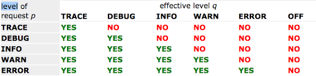
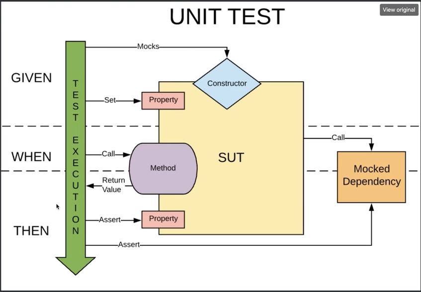
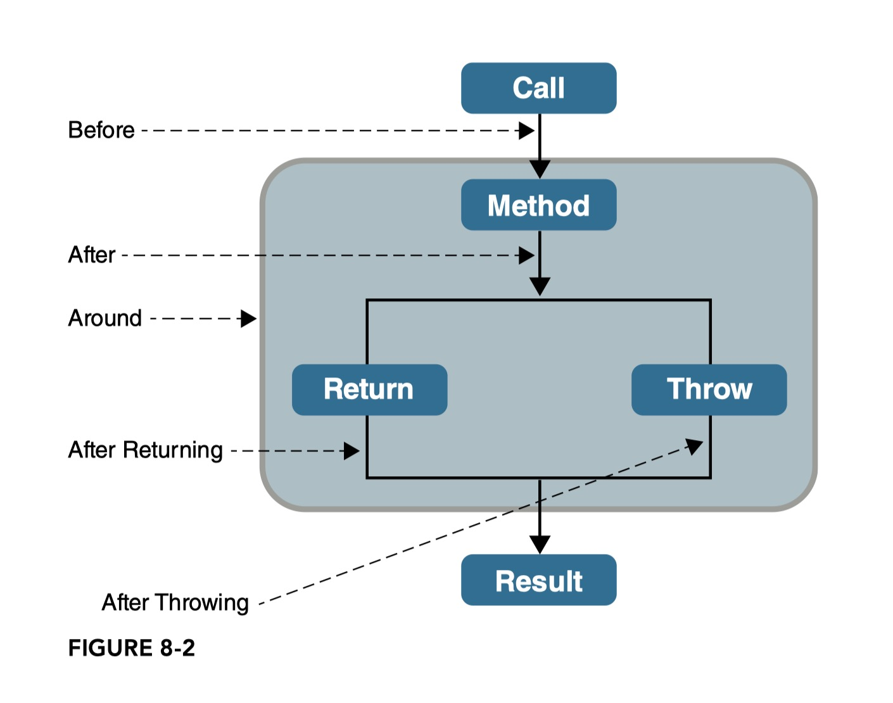
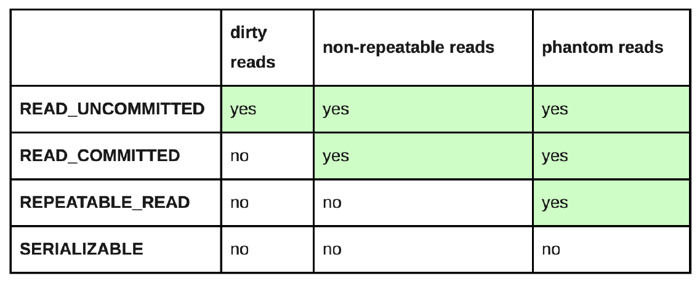

# Spring Note

* [붕어빵좌](https://github.com/depromeet/3dollars-in-my-pocket-backend)
* OOP에 대한 내용도 포함됨

단축키
Ctrl + Shift + V : 마크다운 미리보기
Shift + Alt + V  : 이미지 붙여넣기

### CLI로 docker 사용하기

**docker image란?** : 컨테이너를 생성하는 틀(템플릿)
ex) 리눅스에서 node.js가 설치된 docker image
ex) 리눅스에서의 mysql:8 docker image

**docker container란?**
컨테이너란 호스트 OS상에 논리적인 구획(컨테이너)을 만들고, 어플리케이션을 작동시키기 위해 필요한 라이브러리나 어플리케이션 등을 하나로 모아, 마치 별도의 서버인 것처럼 사용할 수 있게 만든 것입니다. 호스트 OS의 리소스를 논리적으로 분리시키고, 여러 개의 컨테이너가 공유하여 사용합니다. 컨테이너는 오버헤드가 적기 때문에 가볍고 고속으로 작동하는 것이 특징입니다.

* 저장된 이미지들 확인하기
`docker images` : 모든 이미지 확인가능 -> 이미지 ID도 나옴

* 컨테이너 확인하기
`docker ps` : 현재 **실행중인** 컨테이너 -> 컨테이너 ID, 이미지, 이름 등 확인가능
`docker ps -a` : 생성된 **모든** 컨테이너 -> 실행중이지 않은 컨테이너 포함

* 컨테이너 아이디를 통해 해당 컨테이너 로그 확인하기
`docker logs 컨테이너ID`

* 이미지 삭제하기
`docker rmi 이미지ID` : -f를 넣으면 강제 삭제가능 ex) docker rmi -f 이미지ID

* 컨테이너 삭제하기
`docker rm 컨테이너ID` : -f를 넣으면 강제 삭제가능 ex) docker rm -f 컨테이너ID

* 도커 컨테이너 생성하기 예시 (mysql:8 컨테이너 생성)
`docker run --name kdt-gc-coffee -e MYSQL_PORT_HOST=% -e MYSQL_ROOT_PASSWORD=root1234! -p3306:3306 -d mysql:8`
[참고해볼 영상](https://www.youtube.com/watch?v=hWPv9LMlme8)

  

### MySql DB 생성하기

1. 도커 이미지로 컨테이너 생성하기
ex)
`docker run --name kdt-gc-coffee -e MYSQL_PORT_HOST=% -e MYSQL_ROOT_PASSWORD=root1234! -p3306:3306 -d mysql:8`

 

2. Intellij -> Database -> +로 Data Source(MySql) 추가 -> 컨테이너 정보 작성 -> 하단의 Test Connection으로 연결확인 -> 생성

  

************************
### 1. Spring 어노테이션의 스테레오타입 분류
* `@Component` 하위 4컴포넌트들
1. `@Repository`    : Data Access
2. `@Service`       : Service Classes
3. `@Controller`    : Spring MVC
4. `@Configuration` : Java Config

  

************************
### 2. `@Component` 와 `@Bean` 차이점?
(1) 클래스에 `@Component`를 선언하고 해당 클래스를 Bean으로 등록, 클래스의 메소드(반환객체)도 모두 빈으로 등록해줌
(2) 메소드에 `@Bean`을 선언하고 반환하는 객체를 Bean으로 등록. 즉, Class에는 `@Bean`선언 안됨

* `@Component`로 Bean으로 등록되어 있다면 따로 Bean등록을 위한 코드를 짜지 않아도 됨

  

************************
### 3. `@ComponentScan`
해당 어노테이션이 붙은 클래스가 속한 패키지 기준으로 
`@Component`가 붙은 클래스를 모두 Scan하여 Bean으로 등록해줌
<1.> 에서 소개한 스테레오 타입들은 모두 기본적으로 Scan대상임
클래스안의 메소드의 반환객체들도 빈으로 등록

 

* 스캔필터
~~~java
@ComponentScan(basePackages = {"org.prgrms.kdt.order", "org.prgrms.kdt.voucher"}) // 패키지 지정 방법
@ComponentScan(basePackageClasses = {Order.class, Voucher.class}) // 해당 클래스가 속한 패키지를 스캔
// @ComponentScan(excludeFilters ....)와
// @ComponentScan(includeFilters ....)도 있는데 자세한건 구글링 ㄲ
// ex)
@ComponentScan(
    basePackages = {"org.prgrms.kdt.order", "org.prgrms.kdt.voucher"},
    excludeFilters = {@ComponentScan.Filter(type = FilterType.ASSIGNABLE_TYPE, value = MemoryVoucherRepository.class)}
    ) // ASSIGNBLE
~~~

  

************************
### 4. IOC : 제어의 역전(Inversion of Control)
- 프로그램의 제어 흐름을 직접 제어하는것이 아니라 외부에서 관리하는 것
  ex) `OrderServiceImpl` 은 주문관련 서비스에서 필요한 **인터페이스**들을 호출하지만 어떤 구현객체들이 실행될지 모른다.
       프로그램에 대한 제어 흐름에 대한 권한은 모두 `AppConfig`가 가지고 있다.
       심지어 `OrderServiceImpl`도 `AppConfig`가 생성한다.
즉, `OrderServiceImpl` 내부에서 다른 구현체들을 호출하는것이 아니라
외부에서, `AppConfig`가 주입을 해 주는 것이다...!!

  

************************
### 5. 생성자 기반 DI 장점
* 초기화시 필요한 모든 의존관계가 형성되기 때문에 안전
* 컴파일시 잘못된 의존관계가 있으면 오류가 생기기 때문에 잘못된 패턴을 찾을 수 있게 도와줌
* 테스트를 쉽게 해줌 (?)
* 불변성 확보 : final 키워드 관련, Thread-safe 하도록 해줌

  

************************
### 6. 같은 타입의 빈 등록(중복 Bean)
같은 타입의 빈이 2개 이상일때 해당 타입의 의존관계 주입이 필요한곳이 있다면 컴파일 오류
어떤 빈을 사용할지 선택해 주어야 함

1. `@Primary`로 우선순위를 정하여 먼저 주입되어야 할 빈을 선택가능

 

2. 우선순위가 같지만 다른 용도의 빈이 2개라면?
`@Qualifier("이름")`으로 빈을 구분할 수 있음

서버가 여러개인 경우가 아니면 같은 타입의 빈을 등록할 경우는 거의 없음
만약 있다고 해도 `@Primary`를 이용하여 우선순위를 지정하여 사용함
서버가 여러개이고 상황에따라 다르게 사용해야 하는 같은 타입의 빈이 있을때
`@Qualifier("이름")`을 이용할 수 있음

* `@Qaulifier`를 이용하여 DI를 하는 방법
~~~java
@Repository
@Qualifier("jdbc")
public class JdbcVoucherRepository implements VoucherRepository{
    //......
}

@Repository
@Qualifier("memory")
public class MemoryVoucherRepository implements VoucherRepository{
    //......
}

/*************************************/

@Service
public class VoucherService {

    private final VoucherRepository voucherRepository;

    public VoucherService(@Qualifier("memory") VoucherRepository voucherRepository) {
        this.voucherRepository = voucherRepository;
    }
    //......
}
~~~

* ApplicationContext로 바로 getBean하지 못하기 때문에 BeanFactory를 이용하여 Bean을 조회해야 함
~~~java
var voucherRepository = BeanFactoryAnnotationUtils
            .qualifiedBeanOfType(applicationContext.getBeanFactory(), VoucherRepository.class, "memory");
~~~

  

************************
### 7. Bean 생명주기 콜백

#### (1) Bean 생성 생명주기 콜백 순서
1. `@PostConstruct`이 적용된 메소드 호출
2. Bean이 InitializingBean 인터페이스 상속시 afterPropertiesSet 호출
3. `@Bean` 어노테이션에서 initMethod에 설정한 메소드 호출

 

#### (2) Bean 소멸 생명주기 콜백 순서
1. `@PreDestroy`이 적용된 메소드 호출
2. Bean이 DisposableBean 인터페이스 상속시 destroy 호출
3. `@Bean` 어노테이션에서 destroyMethod에 설정한 메소드 호출

~~~java
@Component
public class MemoryVoucherRepository implements InitializingBean, DisposableBean {

    @PostConstruct
    public void postConstruct() {
        System.out.println("postConstruct called !");
    }

    @Override
    public void afterPropertiesSet() throws Exception {
        System.out.println("afterPropertiesSet called !");
    }

    private void init() {
        System.out.println("init called !");
    }

    @PreDestroy
    public void preDestroy() {
        System.out.println("preDestroy called !");
    }

    @Override
    public void destroy() throws Exception {
        System.out.println("destroy called !");
    }

    private void end(){
        System.out.println("end called !");
    }
}

@Configuration
public class AppConfiguration {

    @Bean(initMethod = "init", destroyMethod = "end")
    public MemoryVoucherRepository memoryVoucherRepository() {
        return new MemoryVoucherRepository();
    }
}

// 이후 컴포넌트 스캔을 하면 아래의 출력결과를 가짐

/* 출력결과
postConstruct called !
afterPropertiesSet called !
init called !
preDestroy called !
destroy called !
end called !
*/
~~~

  

************************
### 8. properties
강의에서처럼 OrderProperties 클래스와 같이 **설정**을 하나의 클래스로 모델링하고
간단한 경우만 @Value 어노테이션을 쓰는것을 Spring에서 권장하는 방법

spring boot를 사용하지 않으면, yaml파일을 불러오기 위해서는
설정 정보 클래스에서 `@PropertySource`와 `@EnableConfigurationProperties`를 사용해야 한다.
~~~java
// 예시 코드
@Configuration
@ComponentScan(basePackages = {"org.prgrms.kdt.order", "org.prgrms.kdt.voucher", "org.prgrms.kdt.configuration"})
// Note : yaml
//  - springBoot는 yaml을 지원하지만 spring Framework 자체에서는 yaml을 지원하지 않음
@PropertySource(value = "application.yaml", factory = YamlPropertiesFactory.class)
@EnableConfigurationProperties // Spring Boot없이 yaml파일 사용하려면 붙여줘야 함
public class AppConfiguration
{
    // ...
}
~~~

 

하지만 **Spring Boot**를 사용하면 **자동으로** resources 디렉토리에 있는
application.yaml 또는 application.properties를 읽어 옴

**CoC 패러다임 이란?** - `설정보다는 관례`
위와 같이 yaml파일을 읽어오기 위해 직접 설정하기 보다는
Spring Boot를 이용하여 관례에 따라서 간편하게 설정 할 수 있다.

설정보다 관례(CoC; Convention over Configuration)는 
소프트웨어 개발자가 정해야 하는 수많은 결정들을 줄여주고 단순성을 확보하면서도 
유연함을 잃지 않기 위한 설계 패러다임인 것이다.

  

************************
### 9. Logging
Log Level

예를 들어 log level을 WARN으로 설정하면 WARN과 ERROR에 관한 로그만 출력됨

 

**Logger**
메소드 단위가 아닌 클래스 레벨로 Logger를 만듦
private static final로 생성
slf4j 이용 했음

~~~java
public class OrderTester {
    private static final Logger logger = LoggerFactory.getLogger(OrderTester.class);

    public static void main(String[] args) throws IOException {
        //......
        // 예시 (info 레벨로 log 출력)
        logger.info("logger name -> {} {} {}", logger.getName(), 2, 3);

        // 위의 logger와 비교해 보면 MessageFormat이나 {0} 라고 숫자로 표기하지 않아도 알아서 출력해줌
        System.out.println(MessageFormat.format("test = {0}", 123));
    }
}
~~~

 

**Logback**
Logging Framework 임

Logback 설정하기(설정파일 찾는 순서)
1. logback-test.xml 파일 먼저 찾고 -> test 패키지의 resourses디렉토리 밑에 넣음
2. 없으면 logback.groovy를 찾음
3. 그래도 없으면 logback.xml찾음
    - 2와 3의 logback.groovy or xml 파일은 src.main.resourses 밑에 저장
4. 모두 없다면 기본 설정 전략을 따름 (BasicConfiguration)

[공식문서 참고링크](http://logback.qos.ch/manual/configuration.html)

 

Automatic configuration with logback-test.xml or logback.xml

  

************************
### 10. 단위테스트

  

************************
### 11. JUnit, Hamcrest
**JUnit**
JUnit 4 기반의 코드는 Vintage 모듈
JUnit 5 기반의 코드는 Jupiter 모듈을 사용함

단위테스트 : 클래스단위로 메소드를 test함
단위테스트는 그 자체로 명세서가 될 수도 있음
    ex) 엣지 케이스를 보면서 비즈니스 모델을 확인할 수 있음

* `@BeforeAll` : test가 실행되기 전 한번만 실행
* `@BeforeEach` : 매 테스트가 실행되기 전에 한번 실행
* `@AfterEach` : 매 테스트가 끝난 후 한번 실행
* `@AfterAll` : test가 끝난 후 마지막으로 한번만 실행
* `@Disabled` : 해당 테스트를 스킵해주는 어노테이션

 

**Hamcrest** : 더 다양한 검증 로직(Matcher)을 제공
Junit4에서는 라이브러리에 포함되어 있었지만 5로 오면서 빠지게 됨
spring-boot-starter-test 라이브러리에 포함되어 있음
다양한 Matcher를 제공함
테스트를 할때 대부분 Hamcrest를 많이 사용함

* 코드예시
~~~java
import static org.hamcrest.MatcherAssert.*;
import static org.hamcrest.Matchers.*;
import static org.junit.jupiter.api.Assertions.*;

import java.util.List;
import org.junit.jupiter.api.DisplayName;
import org.junit.jupiter.api.Test;

public class HamcrestAssertionTests {

    @Test
    @DisplayName("여러 Hamcrest matcher 테스트")
    void hamcrestTest() {
        assertEquals(2, 1+1); // JUnit 5
        // Hamcrest
        assertThat(1+1, equalTo(2));
        assertThat(1+1, is(2));
        assertThat(1+1, anyOf(is(2), is(2))); // 1 or 2 일때

        assertNotEquals(1, 1+1); // JUnit 5
        // Hamcrest
        assertThat(1+1, not(equalTo(1)));

    }
    
    @Test
    @DisplayName("컬렉션에 대한 matcher 테스트")
    void hamcrestListMatcherTest() {
        var prices = List.of(2,3,4);
        assertThat(prices, hasSize(3));
        assertThat(prices, everyItem(greaterThan(1)));
        assertThat(prices, containsInAnyOrder(3, 4, 2));
        assertThat(prices, hasItem(greaterThanOrEqualTo(2)));

    }
}
~~~

  

************************
### 12. package 분류
기본적으로 아래의 4개로 패키지 분류
1. Controller
2. Repository
3. Service
4. Domain

프로젝트가 커지면 aggregate를 분류하고 그 안에 위의 4개로 또 분류

  

************************
### 13. Open JDK
오라클에서 제공하는 JDK는 유료이기 때문에 Open JDK를 이용하는것이 좋음
6개월마다 자바 버전이 업데이트 되므로 계속해서 바뀐 내용을 확인해 주는것이 좋음
[Open JDK 링크](openJDK.java.net)

  

************************
### 14. 상태 검증과 행위 검증
**상태검증**은 메서드가 수행된 후 SUT나 협력객체의 상태를 살펴봄으로써 올바로 동작했는지를 판단
**행위검증**은 상태검증과는 다르게 SUT가 협력객체의 특정 메서드가 호출되었지 등의 행위를 검사함으로써 올바로 동작했는지 판단

stub vs mock ?

  

************************
### 15. Test 환경
Test코드를 실행할때 외부 환경에 의해 실행이 안된다면 설계를 잘못한거임
예를 들어 도커의 서버를 멈추었을때 테스트코드가 실행이 안된다면 ? -> 잘못된 설계

그렇다면 어떻게 해결...? 

  

************************
### 16. 트랜잭션이란?
* 하나의 논리적 작업 단위
예를들어 CRUD수행을 모아서 **송금**하겠다 라고 하면 하나    의 논리적 작업 단위가 될 수 있는거임
여기서 해당 트랜잭션으로 바로 송금까지 하는것이 아니라 도중에 오류가 발생하면
작업전으로 원복(롤백)이 가능함
오류없이 잘 작동했다면, Commit하는 시점에서 작업이 완료될 수 있고 DB안의 데이터가 실제로 바뀔 수 있음

  

************************
### 17. AOP(Aspect-Oriented Programming) : 관점 지향 프로그래밍
AOP는 **횡단 관심사(cross-cutting concern)**의 분리를 허용함으로써 모듈성을 증가시키는 것이 목적인 프로그래밍의 패러다임임.
비즈니스로직과 같은 핵심기능과 다른 부가기능을 분리할 수 있음
AOP의 대표적인 예시 : `@Transactional`

분리되었다면 핵심기능에 부가기능을 어떻게 추가할 수 있을까?

#### AOP 적용 방법 (Weaving)
**Weaving** : 타겟의 조인 포인트에 어드바이즈를 적용하는 과정
* 컴파일 시점
* 클래스 로딩 시점
* 런타임 시점 - 프록시 객체 이용

 

#### Spring AOP
spring은 AOP Proxies 방식으로 동작한다.
즉, 런타임 시점에 AOP가 적용됨
spring AOP Process는 2가지 방식이 있음
1. JDK Proxy
2. CGLib Proxy

 

#### AOP 관련 용어
**타겟(Target)**
* 핵심 기능을 담고 있는 모듈로서 부가기능을 부여할 대상

**조인포인트(Join Point)**
* 어드바이스가 적용될 수 있는 위치
* 타겟 객체가 구현한 인터페이스의 모든 메서드

**포인트 컷(Pointcut)**
* 어드바이스를 적용할 타겟의 메서드를 선별하는 정규표현식
* 포인트컷 표현식은 execution으로 시작하고 메서드의 Signature를 비교하는 방법을 주로 이용함

**애스펙트(Aspect)**
* 애스펙트 = 어드바이스 + 포인트컷
* Spring에서는 Aspect를 빈으로 등록해서 사용.

**어드바이스(Advice)**
* 어드바이스는 타겟의 특정 조인트포인트에 제공할 부가기능
* Advice에는 다음 그림과 같이 `@Before`, `@After`, `@Around`, `@AfterReturning`,
`@AfterThrowing` 등이 있음.

 

#### 포인트컷을 이용한 AOP동작 예시

* 코드 예시 - 포인트컷만 따로 빼서 저장한 클래스
~~~java
import org.aspectj.lang.annotation.Pointcut;
public class CommonPointcut {

    // Note : 포인트컷 (Pointcut)
    //   - 예시) "execution(public * org.prgrms.kdt.customer..*Repository.*(*, ..))"
    // execution() -> 포인트컷 expression. execution이 기본이라고 보면되고 많이 쓰이는 것중 within() 이라는것도 있음
    // public * -> 접근지정자, 반환형, *이면 암거나 와도 된다는 뜻
    // org.prgrms.kdt.customer.. -> 여기까지 패키지명, ..은 customer하위 어떤 패키지도 가능하다는 뜻
    // .*Repository -> 여기부터는 클래스명, *Repository는 Repository로 끝나는 클래스 사용한다는 뜻
    // .*(Long, ..)) -> 이건 메소드명, 메소드이름은 상관없고, ()안은 파라미터인데 첫번째 파라미터는 Long이고 그다음은 몇개오든 상관없다는 뜻
    // 애스펙트(aspect) :  어드바이스 + 포인트컷

    @Pointcut("execution(public * org.prgrms.kdt..*.*Service.*(..))")
    public void servicePublicMethodPointcut() {}

    @Pointcut("execution(* org.prgrms.kdt..*.*Repository.*(..))") // 접근지정자, 반환형 모두 *이면 *하나로 대체해야 함
    public void repositoryMethodPointcut() {}

    @Pointcut("execution(* org.prgrms.kdt..*.*Repository.insert(..))")
    public void repositoryInsertMethodPointcut() {}

    // 아래에 위의 포인트컷중 repositoryInsertMethodPointcut를 사용한 예시가 있음
    
}
~~~

 

* 코드 예시 - 애스펙트
~~~java
import org.aspectj.lang.ProceedingJoinPoint;
import org.aspectj.lang.annotation.Around;
import org.aspectj.lang.annotation.Aspect;
import org.slf4j.Logger;
import org.slf4j.LoggerFactory;
import org.springframework.stereotype.Component;

@Aspect // 애스펙트로 등록
@Component // 애스펙트는 빈이어야 함
public class LoggingAspect {

    public static final Logger log = LoggerFactory.getLogger(LoggingAspect.class);

    // 해당 경로에 있는 메소드의 포인트컷을 통해 어드바이스가 동작함
    @Around("org.prgrms.kdt.aop.CommonPointcut.repositoryInsertMethodPointcut()") // 어드바이스, 포인트컷 경로
    public Object log(ProceedingJoinPoint joinPoint) throws Throwable {
        log.info("Before Method called. {}", joinPoint.getSignature().toString());
        Object result = joinPoint.proceed(); // 조인 포인트
        log.info("After Method called with result => {}", result);
        return result;
    }

    // 지정한 포인트컷에 해당하는 모든 메소드는 호출될때 위의 애스펙트가 작동됨
    // 단, Spring Bean으로 등록된 객체에만 Proxy객체가 만들어져서 aop가 적용될 수 있다...!!

}

~~~

#### 어노테이션을 이용한 AOP동작 예시

* 코드예시 - 어노테이션 생성
~~~java
import java.lang.annotation.ElementType;
import java.lang.annotation.Retention;
import java.lang.annotation.RetentionPolicy;
import java.lang.annotation.Target;

@Target(ElementType.METHOD)
@Retention(RetentionPolicy.RUNTIME)
public @interface TrackTime {

}

~~~

 

* 코드 예시 - 애스펙트
~~~java
package org.prgrms.kdt.aop;

import org.aspectj.lang.ProceedingJoinPoint;
import org.aspectj.lang.annotation.Around;
import org.aspectj.lang.annotation.Aspect;
import org.slf4j.Logger;
import org.slf4j.LoggerFactory;
import org.springframework.stereotype.Component;

@Aspect // 애스펙트로 등록
@Component // 애스펙트는 빈이어야 함
public class LoggingAspect {

    public static final Logger log = LoggerFactory.getLogger(LoggingAspect.class);

    // 해당 어노테이션(TrackTime)이 붙은 모든 메소드를 호출하면 아래의 로직이 동작..!!!!!!!!
    @Around("@annotation(org.prgrms.kdt.aop.TrackTime)") 
    public Object log(ProceedingJoinPoint joinPoint) throws Throwable {
        log.info("Before Method called. {}", joinPoint.getSignature().toString());
        long startTime = System.nanoTime(); // 1sec  -> 1,000,000,000 nano sec
        Object result = joinPoint.proceed(); // 조인 포인트
        long endTime = System.nanoTime() - startTime;
        log.info("After Method called with result => {} and time taken {} nanoseconds", result, endTime);
        return result;
    }

}
~~~

  

************************
### 18. Transaction 전파(propagation) & 격리(isolation)

#### Transaction Propagation
* 트랜젝션이 처리되는 메소드에서 그 안에 다른 메소드로인해 또 다른 트랜젝션이 처리되는 경우
* `@Transactional()`의 default는 REQUIRED
* `@Transactional(propagation = Propagation.REQUIRED)` 와 같이 propagation 설정 가능

* **REQUIRED**
트렌젝션이 필요하다는 것을 의미합니다. @Transactional 애노테이션 **기본값**이
기도 합니다. 현재 진행 중인 트랜잭션이 있다면 이 트랜잭션을 사용하고 없는 경
우에는 새로운 트랜잭션이 시작됩니다.

* **MANDATORY**
호출 전에 반드시 진행 중인 트랜잭션이 존재해야 합니다. REQUIRED와 비슷한
듯 하지만 **진행 중인 트랜잭션이 존재하지 않을 경우 예외가 발생**하게 됩니다.

* **REQUIRED_NEW**
항상 새로운 트렌젝션이 시작됩니다. 이미 진행 중인 트랜잭션이 있으면 그 트랜잭
션은 해당 메소드가 반환되기 전에 잠시 중단되고 새로운 트렌젝션이 시작합니다.
그리고 새로 시작된 트랜잭션이 종료되고 나서 기존 트랜잭션이 이어서 동작합니
다.

* **SUPPORTS**
트렌젝션이 꼭 필요하지는 않는데 만약에 진행 중인 트랜잭션이 있는 경우에는 해
당 트랜잭션을 사용하게 됩니다. (트랜잭션이 없는 경우는 트랜잭션 사용안함)

* **NOT_SUPPORTED**
트렌젝션이 필요로 하지 않다는 것을 의미합니다. SUPPORT와 달리 진행 중인
트랜잭션이 있다면 해당 메소드가 반환되기 전까지 잠시 중단하고 메소드 실행이
종료가 되고 나서 기존 트랜잭션을 계속 진행하게 됩니다.

* **NEVER**
트랜잭션 진행 상황에서 실행 될 수 없다. 만약 이미 진행 중인 트랜잭션이 존재하
면 예외 발생

* **NESTED**
이미 진행 중인 트랜잭션이 존재하면 중첩된 트랜잭션에서 실행되어야 함을 나타
낸다. 중첩된 트랜잭션은 본 트랜잭션과 독립적으로 커밋되거나 롤백될 수 있다.
만약 본 트랜잭션이 없는 상황이라면 이는 REQUIRED와 동일하게 작동한다. 그
러나 이 전파방식은 DB 벤더 의존적이며, 지원이 안되는 경우도 많다.

 

#### Transaction Isolation Level
* 트랜젝션 격리 수준

* 개별 트랜젝션이 독립되려면?
한 트랜젝션이 있을때 그 트랜젝션내에서 변경된 내용만을 다루어야 함
다른 트랜젝션에 의해 변경된 데이터에 대해서는 영향을 받지 않아야 함

* 동시에 여러 트랜젝션이 처리될 때 독립성or격리성에 대한 단계를 나눈것

* 격리 수준은 크게 4가지로 나뉨
    1. READ UNCOMMITTED
        어떤 트랜잭션의 변경내용이 COMMIT이나 ROLLBACK과 상관없이 다른 트랜잭션에서 보여진다.
        한 트랜젝션에 의해 바뀐 데이터가 커밋이 되지 않아도 다른 트랜젝션에서 그냥 그대로 읽어올 수 있는 것
    2. READ COMMITTED
        어떤 트랜젝션에 의해 바뀐 데이터중 Commit이 확정된 데이터만 다른 트랜젝션에서 조회할 수 있음
    3. REPEATABLE READ
        먼저 발생한 트랜젝션이 읽은 데이터를 다른 트랜젝션에서 **업데이트**하거나 **삭제**할 수 없도록 방지
        같은 트랜젝션 내에서 쿼리를 여러번 날려도 일관성이 있는 결과 반환을 기대할 수 있음
    4. SERIALIZABLE
        REPEATABLE READ와 동일하지만 업데이트와 삭제에 더하여 추가(insert)까지 방지해 줌
        따라서 완벽하게 트랜젝션 read에 대한 일관성을 보장해 줄 수 있음
    
    5. Isolation.DEFAULT
        Spring에서 Isolation.DEFAULT라는 격리도 추가로 제공하는데
        사용하는 RDBMS에서 설정한 Isolation Level을 따르게 해줌

 

* Dirty Read
READ UNCOMMITED 상황에서 발생할 수 있는 문제.
커밋되지 않은 수정중인 데이터를 다른 트랜젝션에서 읽을때 발생한다.
Dirty Read 예시
    1. `트랜젝션A`의 격리수준이 READ UNCOMMITED일때
    2. `트랜젝션A`에서 사원1의 이름을 Jack에서 Tom으로 바꿈
    3. `트랜젝션B`에서 사원1의 이름을 조회하면 Tom이 조회됨
        > `트랜젝션A`에서 변경사항을 커밋하지 않았음에도 격리수준에 의해 `트랜젝션B`에서 변경된 내용이 출력됨

    이를 더티 리드(Dirty Read)라고 한다
    `트랜젝션A`에서 문제가 발생해 사원1의 데이터가 Rollback이 되어도
    `트랜젝션B`에서는 이전에 조회한 Tom으로 로직을 수행하기 때문에 논리적 오류가 발생할 수 있는 문제가 있음

 

* Non-Repeatable Reads
한 트랜젝션내에서 같은 쿼리를 2번 수행할때, 
한번의 쿼리 수행후 다른 트랜젝션이 값을 수정하거나 삭제하면 2번째 쿼리는 앞의 쿼리와는 다른 결과를 반환할 수 있으므로
일관되지 않은 상황이 발생되는 것
더 자세히 정리하기

 

* Phantom Reads
한 트랜젝션에서 일정한 범위의 레코드를 여러번 읽어 올때
첫번째 쿼리에서는 없던 유령의 레코드가 두번째 쿼리에서 나타나는 현상
더 자세히 정리하기

  

************************
### 19. Handler
스프링에서는 컨트롤러를 `핸들러`라고도 부름

  

************************
### 20. POJO
Plain Old Java Object, 간단히 POJO는 말 그대로 해석을 하면 오래된 방식의 간단한 자바 오브젝트라는 뜻.
특정 '기술'에 종속되어 동작하는 것이 아닌 순수한 자바 객체를 뜻함

 

**왜 POJO를 지향해야 하는가?**
특정 기술과 환경에 종속되어 의존하게 된 자바 코드는 가독성이 떨어져 유지보수에 어려움이 생김.
또한, 특정 기술의 클래스를 상속받거나, 직접 의존하게 되어 확장성이 매우 떨어지는 단점이 있음. 
이것은 객체지향의 화신인 자바가 객체지향 설계의 장점들을 잃어버리게 된 것을 뜻함
그래서 POJO라는 개념이 등장. 
즉, 본래 자바의 장점을 살리는 `오래된 방식의 순수한 자바객체`라는 뜻임

  

************************
### 21. Validation은 어디에서 ?
1. 비즈니스 모델에서의 validation은 해당 Domain 엔티티에 넣는게 좋음
예를들어 Customer를 insert할때 Validation한다고 하면 그 코드에 대한 메소드는 Customer에 구현이 되어 있어야 함

2. API 요청에 대한 Validation은 DTO에 만드는것이 좋음

  

************************
### 22. @RequestBody, @RequestParam, @ModelAttribute, @pathvariable 차이점?

  

************************
### 23. Put Patch
Put은 멱등함 -> 통째로 교체
Patch는 멱등하지 않음

  

************************
### 24. package를 나누는 방법
1. 계층별로 package를 구성한다.
service
controller
repository
domain
....
이런식으로 테이블이 간단한 프로젝트의 경우 위와 같이 구성해 볼 수 있음

2. 어그리게이트를 만들고 어그리게이트마다 계층별로 package를 나눈다.
- order
    - controller
    - service
    - repository
    - exception
    - ...
- memeber
    - controller
    - service
    - repository
    - exception
    - ...
- config
- ....

  

************************
### 25. EndPoint
엔드포인트는 서비스를 사용가능하도록 하는 서비스에서 제공하는 커뮤니케이션 채널의 한쪽 끝. 
즉 **요청을 받아 응답을 제공하는 서비스를 사용할 수 있는 지점**을 의미한다.

 

예를 들어 지하철 최단 거리 경로를 제공하는 웹 서비스가 있다고 하자. 
이 서비스를 이용하는 사용자는 출발역과 도착역을 설정하고 최단 경로를 찾는 버튼을 누른다.
이때 최단 거리 경로를 구하는 서비스를 이용하기 위한 **요청이 향하는 URI**가 엔드포인트이다. 
이 웹 서비스는 유효한 형태로 엔드포인트에 요청이 전달되었을 경우 
사용자가 알 필요 없는 서비스 내부 로직을 실행하고 응답을 반환한다.

  

************************
### 26. API 문서화
Restdocs / swagger 두가지가 있는데
swagger 같은 경우는 코드에 문서화를 하기위한 어노테이션 코드가 들어가기 때문에
좋은 방법이라고 할 수 없음
따라서 현업에서는 Restdocs를 많이 씀

**Restdocs**
[따라하기](https://spring.io/guides/gs/testing-restdocs/)

**asciidocs Request, Response formating**
[참고블로그](https://rok93.tistory.com/entry/Spring-Rest-Docs-%EC%86%8C%EA%B0%9C-%EB%B0%8F-%EC%82%AC%EC%9A%A9%EB%B2%95)

  

************************
### 27. @EqualsAndHashCode
`@EqualsAndHashCode`
equals()와 hashCode()를 생성해 줌
static 또는 transient가 아닌 모든 필드들이 대상이 된다.
명시적으로 특정 필드를 제외하려면 exclude={"field1", "field2"} 옵션을 추가
명시적으로 특정 필드를 포함하려면 of={"field1", "field2"} 옵션을 추가

  

************************
### 28. @Builder
`@Builder`와 `@NoArgsConstructor`를 함께 사용하려면, 
`@AllArgsConstructor`도 함께 사용하거나 모든 필드를 가지는 생성자를 직접 만들어 줘야 한다. 
`@Builder`를 사용할 때 `@NoArgsConstructor`뿐만 아니라 손수 만든 다른 생성자가 있다면, 
그 때도 모든 필드를 가지는 생성자가 필요하다.

`@Builder` : 빌더 패턴
`@AllArgsConstructor` : 존재하는 모든 필드에 대한 생성자를 자동으로 생성
`@NoArgsConstructor` : 기본 생성자 생성

초기화해야하는 필드가 있다면,
생성자에 `@Builder`를 붙이고 변경가능한 값들만 파라미터로 주고 필요한 값들을 초기화 하여 빌더를 사용한다.

* 예시코드
~~~java
@Table(name = "mapgakco")
public class Mapgakco {
    // ....
    @Builder
    public Mapgakco(String title, Integer applicantLimit, LocalDateTime deadline, String content,
        String location, Double latitude, Double longitude, LocalDateTime meetingAt, User user
    ) {
        this.title = title;
        this.applicantLimit = applicantLimit;
        this.deadline = deadline;
        this.content = content;
        this.location = location;
        this.latitude = latitude;
        this.longitude = longitude;
        this.meetingAt = meetingAt;
        this.user = user;
        this.status = MapgakcoStatus.GATHERING; // 초기화하여 변경방지
        this.view = 0; // 초기화하여 변경방지
    }

    // ....
}
~~~

  

************************
### 29. Json 직렬화, 역직렬화 어노테이션 정리
* [자세한 내용은 생략](https://pjh3749.tistory.com/281)

  

************************
### 30. Anti-OOP : if문 - 정적 팩토리 메서드 참고
* [참고 블로그](http://redutan.github.io/2016/03/31/anti-oop-if)

  

************************
### 31. @RequestParam null값
* 아래와 같이 null을 허용가능

~~~java
void method(@RequestParam("userId", required = false) Long userId) {...}
~~~

* mockMvc : 
    - 문자열이 들어가야 해서 일반 값이면 문자열("")이나 String.valueOf()로 넣어주어야 하지만
    - null은 아래와 같이 (String)null 로 해결가능
~~~java
ResultActions actions = mockMvc.perform(
   get("/api/v1/users/locations")
    .contentType(MediaType.APPLICATION_JSON)
    .param("course", (String) null)
    .param("generation", (String) null)
    .content(objectMapper.writeValueAsString(request)));
~~~

  

************************
### 32. `@ModelAttribute`
`@RequestParam` 와의 차이점은 1:1매핑이냐 객체매핑이냐 차이임

`@ModelAttribute`사용시 장점은 [블로그참고](https://galid1.tistory.com/769)

  

************************
### 33. `@Valid`와 `@Validated`차이
* `@Valid`는 java표준, `@Validated`는 스프링 전용 검증 애노테이션임
    둘중 암거나 사용해도 동일하게 작동하지만, `@Validated`를 사용하는 이유는
    1. `@Validated`는 groups라는 기능이 있다. (근데 안씀)
    2. 따로 dependency를 추가할 필요도 없다. (`@Valid`는 gradle에서 의존관계 추가해 주어야 함.)
    3. Java표준을 따르면 프레임워크 변경시 코드를 변경할 필요가 없다. 하지만 거의 spring쓰기 때문에 상관없다.

* 검증순서
    1. `@ModelAttribute`각각의 필드에 타입변환 시도
        * 성공하면 다음으로감(2.로)
        * 실패하면 typeMismatch로 FieldError 추가 
        (예를들어 Integer인데 String이 오거나 하면 2.Validator적용이 안됨)
    2. Validator 적용
        * `@NotBlank`, `@Max` 등과 같은 어노테이션 확인함

  

************************
### 34. 

  

************************
### 1. 

  

************************
### 1. 

  

************************
### 1. 

  

************************
### 1. 